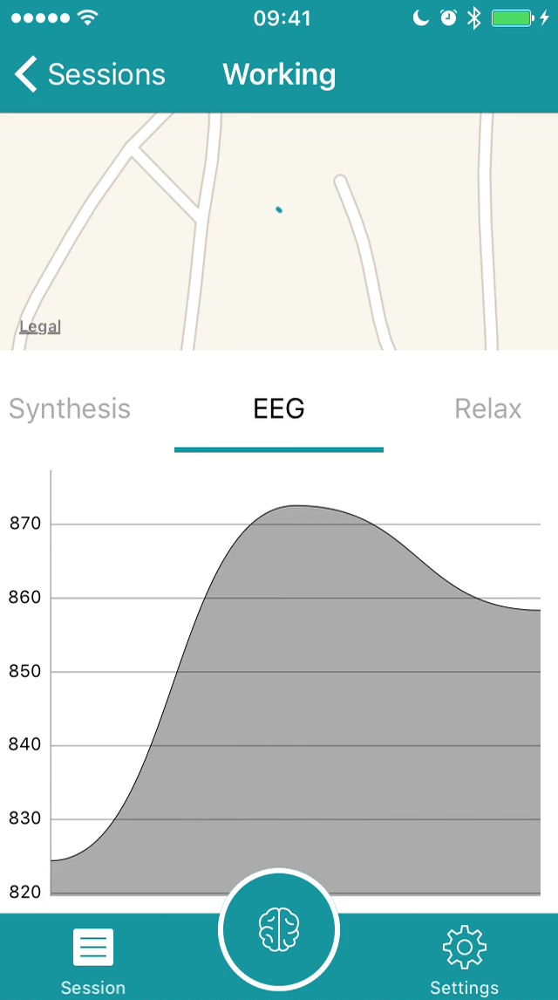

<h1 align="center">
​    
​    <br />
​    AnalytiCeM
</h1>

  

## About

AnalytiCeM is a mobile application that retrieve and analyze brain data. The app works with an IoT device, [Muse](http://choosemuse.com/), that monitor brain activity.

|            Main             |          Synthesis          |
| :-------------------------: | :-------------------------: |
|  |  |

##### Demo available here: https://www.youtube.com/watch?v=522_h5welp8

## Features

- Connect to Muse headband
- Acquire brain data
- Query contextual data
- Synthesis/Report

## Requirements 

- iOS 10.0+
- Xcode 8.0+
- Swift 3.0+

## Installation

### CocoaPods

This project uses [CocoaPods](http://cocoapods.org), a dependency manager for Cocoa projects. You can install it with the following command:

```bash
$ gem install cocoapods
```

> CocoaPods 1.1.0+ is required.

Then navigate to root folder of the project and run the following command:

```bash
$ pod install
```
### OpenWeatherMap

This project uses [OpenWeatherMap](https://openweathermap.org/), to query the weather data. You'll need an API key in order to make it work. You can get it [here from free](http://openweathermap.org/appid).

Then create a file `Keys.plist` in the project folder, containing this:

```xml
<?xml version="1.0" encoding="UTF-8"?>
<!DOCTYPE plist PUBLIC "-//Apple//DTD PLIST 1.0//EN" "http://www.apple.com/DTDs/PropertyList-1.0.dtd">
<plist version="1.0">
<dict>
	<key>OpenWeatherMap</key>
	<string>YOUR_API_KEY</string>
</dict>
</plist>
```

Don't forget to replace `YOUR_API_KEY`.

## Usage

See demo : https://www.youtube.com/watch?v=522_h5welp8

## License

AnalytiCeM is available under the MIT license. See the LICENSE file for more info.